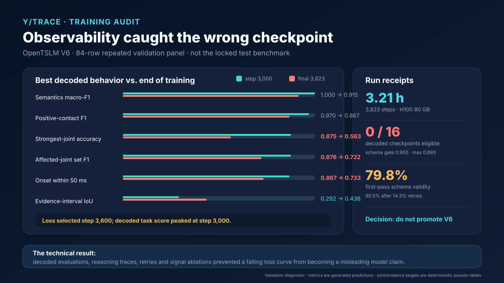

# OpenTSLM V6: training observability caught the wrong checkpoint



## The result in one sentence

The conversational OpenTSLM run learned useful signal-conditioned behavior, but its decoded quality
peaked before its token loss; because an unmet schema gate prevented every decoded checkpoint from
being retained, the instrumentation caught a checkpoint-selection failure that validation loss alone
would have hidden.

**Decision:** do not promote V6 from this audit. Keep the locked canary-v4 test comparison for the
hackathon demo, and present V6 as evidence that Trace's training workflow observes behavior rather
than trusting a falling loss curve.

## What ran

| Item | Receipt |
|---|---:|
| Architecture | OpenTSLM SoftPrompt + Llama 3.2 1B + HAR warm start |
| Input | Seven synchronized external-joint-torque channels, 1,024 samples at 1 kHz |
| Training source windows | 8,192 |
| Conversational views | 57,344: seven intents per source window |
| Effective batch size | 15: batch 3 × gradient accumulation 5 |
| Training | One epoch, 3,823 optimizer steps |
| Hardware / duration | NVIDIA H100 80 GB / 3.21 hours |
| Validation generation panel | 84 rows; 12 per intent |
| Decoded validation checks | 16 on the same fixed panel |

The seven intents were summary, contact, interaction semantics, onset, strongest joint, affected
joints, and evidence interval. Event semantics and manual onset are source annotations. Strongest
joint, affected joints, and evidence interval are deterministic signal-derived pseudo-labels. All
returned values and rationales are model predictions.

One provenance defect is retained rather than silently repaired: the immutable manifest's headline
hypothesis says `focused_three_intent_curriculum_without_channel_permutation`, while its authoritative
curriculum and materialized-count fields record all seven intents and 57,344 views. The W&B label was
corrected later; this archive preserves the original manifest and flags the mismatch.

## The checkpoint-selection failure

The predeclared decoded score was the mean of strongest-joint accuracy and onset-within-50-ms.
Step 3,000 was the best observed decoded point. Teacher-forced validation loss continued to improve
and selected step 3,600 instead.

| Validation metric | Step 3,000 | Final step 3,823 | Change |
|---|---:|---:|---:|
| Positive-contact F1 | 0.970 | 0.867 | −0.103 |
| Semantics macro-F1 | 1.000 | 0.915 | −0.085 |
| Strongest-joint accuracy | 0.875 | 0.563 | **−0.313** |
| Affected-joint set F1 | 0.876 | 0.722 | **−0.154** |
| Onset within 50 ms | 0.867 | 0.733 | **−0.133** |
| Evidence-interval IoU | 0.292 | 0.436 | +0.144 |

This is not a claim that step 3,000 would win on unseen data. The panel is small and was inspected
16 times. It shows that likelihood and task behavior selected different candidates.

No `best_grounding_model.pt` was produced. All 16 decoded evaluations were ineligible because the
first-pass schema gate required 0.95 while the best observed value was 0.893. Contact and semantics
did pass their respective gates at some checkpoints. The retained `best_model.pt` is the
teacher-forced-loss checkpoint at step 3,600, SHA-256
`7c69114d54132dd2641d59a54dc97d435ab7c578dfb320831485871012f83f62`.

## Final behavior by conversational intent

Each row below has only 12 validation examples. Exact match is intentionally strict; for temporal
questions a numerically useful near miss still fails exact match.

| Intent | Exact | Schema-valid | Retry used | Rationale present |
|---|---:|---:|---:|---:|
| Summary | 0.333 | 1.000 | 0.000 | 1.000 |
| Contact | 0.500 | 0.833 | 0.167 | 0.500 |
| Semantics | 0.833 | 1.000 | 0.167 | 0.500 |
| Onset | 0.333 | 1.000 | 0.083 | 0.833 |
| Strongest joint | 0.667 | 0.833 | 0.167 | 0.583 |
| Affected joints | 0.250 | 0.667 | 0.333 | 0.667 |
| Evidence interval | 0.333 | 1.000 | 0.083 | 0.917 |

Across all 84 rows, JSON parse validity was 0.976 and schema validity after retry was 0.905. The
first-pass schema rate was only 0.798 and 14.3% of rows required a second decode. Rationale coverage
was 0.714; after normalizing numbers and joint names, only 43.3% of present rationales were unique.
These checks describe output behavior; they do not establish that the rationale faithfully explains
the model's computation.

The overlapping failure census found 24 missing rationales, 12 retry-dependent responses, nine
affected-joint errors, nine evidence intervals below 0.5 IoU, seven strongest-joint errors, six
schema-value violations, four contact errors, four onset errors over 50 ms, and two semantic errors.
Counts overlap because one response can fail several contracts.

## Evidence that the model used telemetry

The final paired zero-signal canary changed 75% of predictions. A separate 12-session diagnostic on
the retained step-3,600 checkpoint changed every onset prediction after a 64 ms signal shift and
changed 83.3% of joint predictions after a channel swap. Channel-permutation accuracy was only
0.583, so sensitivity is demonstrated but reliable equivariance is not.

On the final covered onset rows, predicted versus target onset correlation was 0.903 and MAE was
48.7 ms, versus 130.3 ms for a constant-median estimate on those same rows. These are validation
diagnostics, not a safety, causality, real-time, or cross-robot claim.

## What to say on stage

> We did not trust a falling training loss. We decoded a fixed conversational panel throughout the
> run, logged first-pass and retry behavior, and ran zero-signal and perturbation checks. That
> observability showed that task behavior peaked around step 3,000 while token loss kept improving.
> It also caught a configuration issue: our schema gate was never reached, so the best behavioral
> checkpoint was never retained. We therefore did not promote this run. That is the value of the
> training infrastructure: it makes model limitations visible before they become operator-facing
> claims.

Use the [locked comparison](../report/comparison.md) for the 512-window held-out benchmark. Use this
artifact as the separate training-observability slide. Do not place V6's validation numbers into the
held-out leaderboard.

## Reproduce the audit

The archived source directory contains the exact status and manifest files, compressed metrics log,
and final 84 generated responses copied from the Nebius run. Their original uncompressed SHA-256
digests are recorded in [the receipt](source/receipt.json).

```sh
python model_training/scripts/analyze_failure_modes.py \
  --run-dir docs/submission/evaluation/v6-validation/source \
  --output-dir /tmp/trace-v6-failure-analysis
```

Outputs include the [machine-readable audit](report/failure_analysis.json), [full findings](report/failure_analysis.md),
and [checkpoint trajectory](report/checkpoint_trajectory.csv). The corresponding W&B run is
[x4212yyj](https://wandb.ai/atakan_topaloglu-eth-z-rich/robot-observability/runs/x4212yyj).

## Scope

This run does not update the locked test benchmark. The same 84 validation rows were repeatedly
observed, rare joint slices are under-supported, the zero-signal and perturbation panels contain only
12 examples, and no new recording groups were reserved for confirmation. The existing canary-v4
test results remain the submission's model comparison.
